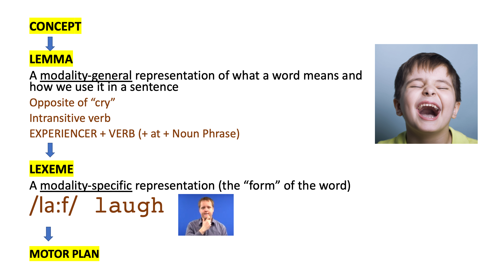

# 11 - Language production

Look at the following speech errors. What does this say about the integration between (a) planning the structure of the sentence, and (b) inserting words in sentences, and (c) producing phonemes.

1. I'm a weekend for maniacs.

Conclusions:

1. The sentence frame is appropriate but the words are in the wrong position. Therefore, it looks as if the sentence frame has been chosen before the words have been inserted
2. The voicing plural -s on maniac**s** is consistent with the previous consonant. Therefore the voicing rule has been applied after the word swap has taken place.
3. Combining these two observations, we have evidence for 3 stages: (1) a stage which involves the selection of the frame (2) a stage which involves the insertion of words (3) a phonetic stage where the phonetic realisation of affixes is determined.

## Models of sentence production

These all start with an abstract plan of what we're going to say, and finish with a precise articulated form. The dominant models were proposed by Garrett (1975) and Levelt (1989). Garrett proposes 5 stages

1. Message level - Very abstract representation of what we are going to say
2. Functional level - Activations of relevant lemmas. Still no syntactic frame
3. Positional level - Syntactic frame chosen, insertion of invariant lexemes/morphemes
4. Phonetic level - Insertion of variant lexemes/morphemes and syllabification
5. Articulatory level - Speech motor programme assembled.

Levelt proposes a more course-grained hierarchy

1. Conceptual level (corresponding to Garrett's message level)
2. Formulation level (corresponding to Garrett's Function, Positional, and Phonetic levels)
3. Articulation level (corresponding to Garrett's Articulatory level)

### 1. The message level

#### 1a. What information is represented at the message level?

A mental representation of the thoughts we wish to put into words. We know what **entities** we wish to talk about, and what kind of **situation** or **event** they are participating in. We must encode **relational information**, e.g. what is the relationship between an entity and an action? Is that entity the AGENT of the action, or the PATIENT of the action. At a later stage, the entities will be mapped onto *arguments*, while the situation/event will be mapped onto the *verb*.

In addition, to specifying entities and situations we take a particular **perspective** on the action. For example, we to decide which entity to **focus** on. Typically, the thing were are focusing on will come in non-subject position, will be specified with a full Noun Phrase (as opposed to a pronoun), and will take stress, e.g.

1. I saw a strange man in the street. [ He TOPIC ] was wearing [ the weirdest clothes I've ever seen FOCUS ].

We must also decide when the event took place (which will be expressed via **tense**), and how we wish to focus on the verb, e.g. do we wish to be inside the event, or outside the event. This is expressed as **grammatical aspect**.

1. John has chopped the carrot = PERFECTIVE aspect for completed event
2. John is chopping the carrot = PROGRESSIVE aspect for ongoing event

#### 1b. How do we get from the Message level to the Functional level?

We **retrieve** (a) the lemmas (b) the argument structure

We assign thematic thematic relations

### 2. Functional level

#### 2a. What information is represented at the functional level?

Consists of **semantic information**: arguments with correct roles

**Focusing information** (e.g. which arguments to focus on, or how we are going to focus on the verb) may also be represented at this level

There is **no syntactic informatio**n, e.g. how we are going to order the words in a sentence.

#### 2b. How do we get from the Functional level to the Positional level?

We **retrieve** (a) the lexemes (b) the syntactic frame

We **link** or **map** the arguments to their correct position in the frame.

The syntactic planning frame consists of (a) closed class morphemes, and (b) slots/placeholders for open class morphemes, e.g.

1. [DET] …….. [AUX-be] ……... [+prog].[DET] ……………… [PREP].[DET] …………...

   (**dative**, e.g. *the woman is giving the flowers to the boy*)

1. [DET] …….. [AUX-be] ……... [+perf].[PREP].[DET] ………….

   **(passive**, e.g. *the cat was chased by the dog*)

2. [DET] ……...   ……...…[+past].[DET]……....   [PREP].[DET]…………....

   (**locative**, e.g. *the dog chased the cat up the tree*)

#### Errors in children

Have a look at these errors in children. How have they arisen?

1. Can I fill some salt into the bear?
2. I'm going to cover a screen over me.         (Bowerman, 1982)
3. The lady is filling the sweets into the jar.
4. The lady is covering the scarf on her head.       (Ebbels, 2007)

Answer: the wrong planning frame has been chosen, but the arguments have been linked to the right position in the planning frame.

### 3. Positional level

#### 3a. What information is represented at the Positional level?

Now we have syntactic information!

We represent the **sentence frame**, and **lexemes which are phonetically invariant** (i.e. their pronunciation is similar whatever context they occur in)

#### 3b. How do we get from the Positional level to the Phonetic level?

We **retreive** (a) segments, and (b) metrical structure

We assemble a phonological sequence (consisting of segments, combined with metrical structure).

Evidence that segments and metrical structure are stored separately:

1. Stress shift - to ensure that stressed syllables do not come close to each other.
   1. She's <u>fif-**teen**</u> / I saw **<u>fif**-teen</u> **men**.
   2. Five o'**clock** in the <u>after-**noon**</u> / We had <u>**after**-noon</u> **tea**.
   3. It was <u>ca-ta-**stroph**-ic</u> / It was a <u>**ca**-ta-strophic</u> **fai**lure
2. Evidence from aphasia (Nickels & Howard, 1999)
   1. Aphasic individuals often produce phonemes in correct order, but not correct stress pattern
   2. Are much better at naming items with more frequent stress patterns

### 4. Phonetic level

#### 4a. What is represented at the phonetic level?

A phonological sequence consisting of segments, and information related to metrical structure (e.g. word stress). **Phonetically-variant** lexemes/phonemes are realised at this level, e.g.

1. DETERMINER: A book / A**n** elephant
2. DETERMINER: Th**e** man / Th**e** essay (tongue is retracted for second)
3. PARTICLE: I want t**o** eat / I want t**o** drink (second is longer and involves more lip rounding)

A number of errors may occur at this level including

1. Swapping errors, e.g. cherry tart -> terry chart
2. Anticipation errors, e.g. terry tart -> terry chart
3. Perseveration errors, e.g. cherry tart -> cherry chart

NB these errors respect syllabic position, so perhaps they occur later at the syllable retrieval stage?

#### 4b. How do we get from the Phonetic level to the Articulatory level?

We **retrieve** syllables, along with their articulation plans.

We **assemble** motor instructions.

#### Motivation for syllables as units of representation

1. Liaison, e.g. why are you said -> wai - **j** - a: -ju: - sad
2. Resyllabification (where a segment from one word/morpheme occurs in a syllable with segments from another word/morpheme)
   1. *A versus An* - /n/ is resyllabified
   2. Last^h^ hour - aspiration phenomena suggest that /t/ has been rsyllabified (as aspiration only occurs syllable-initially)

## Bibliography

Bowerman, M. (1982). Evaluating competing linguistic models of language acquisition data: developmental errors with causative verbs. *Quaderni Di Semantica*, *3*, 5–66.

Ebbels, S. H., van der Lely, H. K. J., & Dockrell, J. E. (2007). Intervention for Verb Argument Structure in Children With Persistent SLI: A Randomized Control Trial. *Journal of Speech, Language and Hearing Research*, *50*(5), 1330.

Garrett, M.F. (1975). *Syntactic process in sentence production* In G. Bower (Ed.). Psychology of learning and 
motivation: Advances in research and theory. 9:133-177.

Jackendoff, R. (1990). *Semantic structures*. MIT Press.

Levelt, W. J. M. (1989). *Speaking: from intention to articulation*. Cambridge, MA: MIT Press.

Nickels, L., & Howard, D. (1999). Effects of lexical stress on aphasic word production. *Clinical Linguistics & Phonetics*, *13*(4), 269–294. <https://doi.org/10.1080/026992099299086>