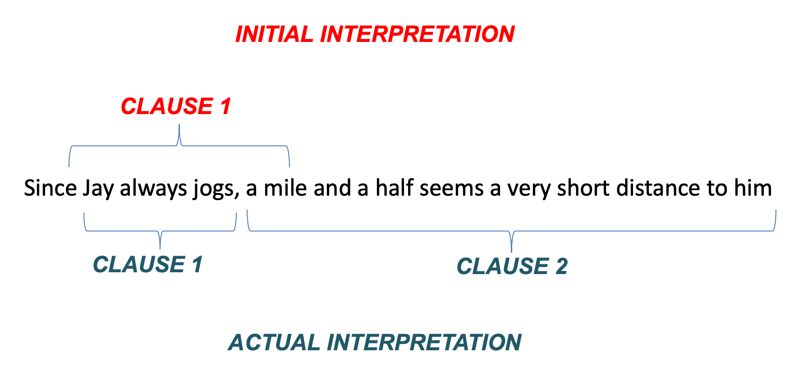
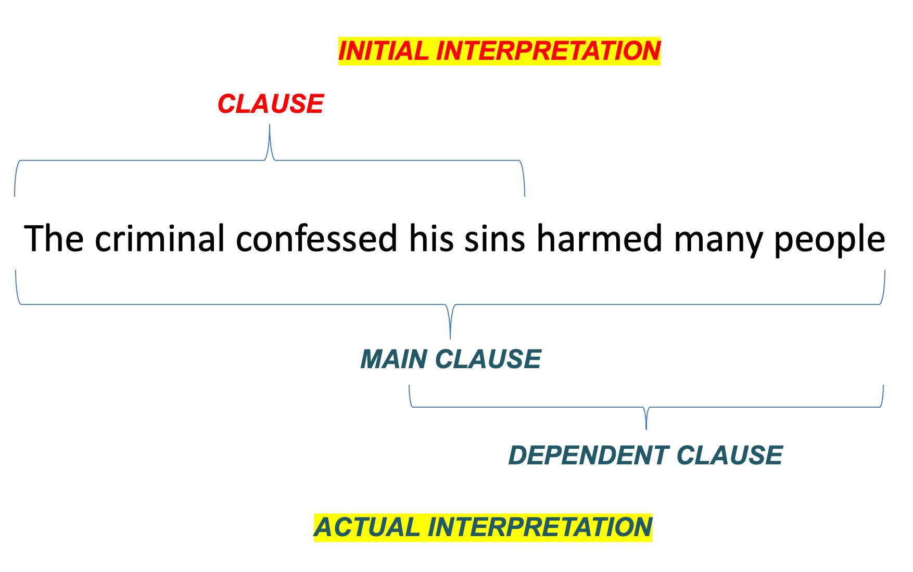
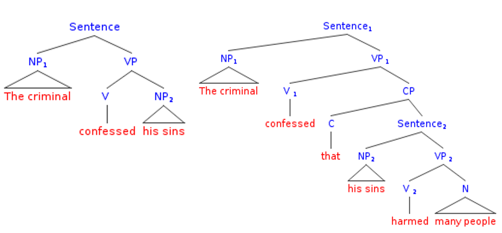
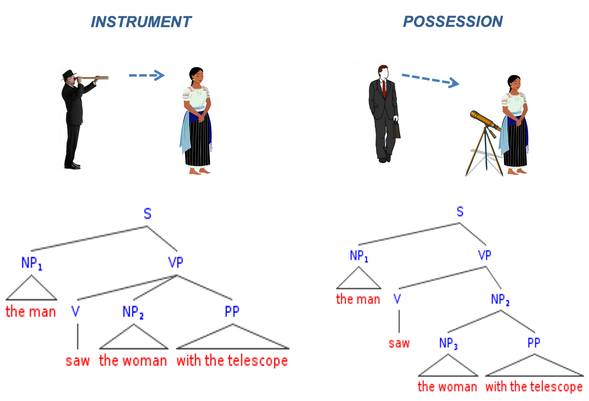
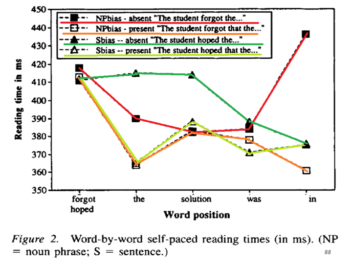
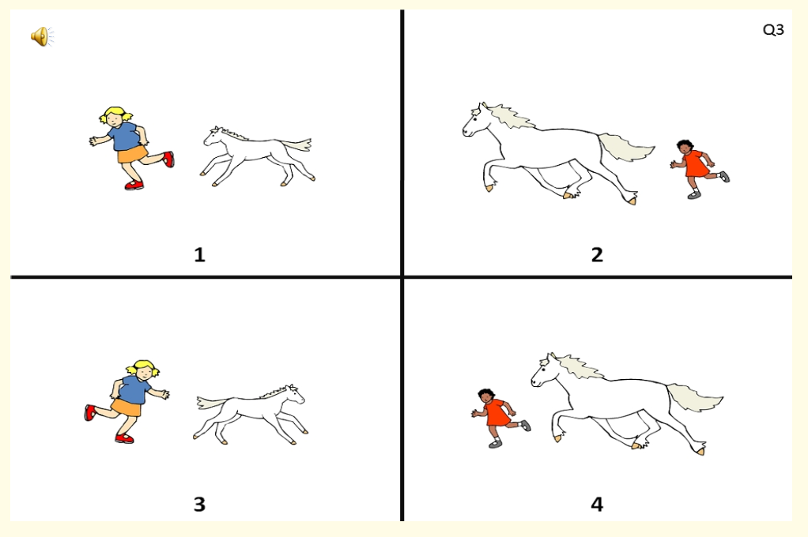

# 15 - (Spoken) sentence comprehension

## Garden path effects

### Ex1: Jogging example

(1) Since Jay always jogs half a mile seems a short distance to him

When we process this sentence we have a "moment of disorientation" when we hear the word *seems*

### Explanation

We interpret *half a mile* as the object of *jog*, but it is the subject of the following clause, e.g.

INITIAL INTERPRETATION:

(a) Since [ Jay always jogs **half a mile** OBJECT OF "JOG" ]

ACTUAL INTERPRETATION:

(b) Since [ Jay always jogs ] [ **half a mile** SUBJECT OF "SEEMS" seems a short distance to him ]

We have a bias to keep the clause open for as long as possible

### Ex2: Confessing your sins

(2) The criminal confessed his sins harmed many people

Again, a bias to keep the clause open for as long as possible

Or a bias to build a tree with fewer nodes?

 

### What are garden paths?

We temporarily misanalyse the structure of the sentence.

The sentence "leads us up the garden path".

Recovery is costly because it involves (a) abandoning our current interpretation of the sentence (b) mentally "rewinding", e.g. using our short-term memories.

### What is their significance?

We make an early commitment to a structural interpretation.

We use a *heuristic*, a dumb but fast procedure which gives the right results most of the time.

Why?

We do this because we we need to process language *quickly*. Speed is of the essence because we need to process so many different kinds of information, e.g. syntactic, phonological, lexical, pragmatic.

We prioritise *speed* above *accuracy*

Early accounts of garden path effects, e.g. Jill Frazier, *The sausage machine*, argue that they demonstrate the "autonomy" of syntax, i.e. syntactic processes are separate from other linguistic processes, e.g. semantic, lexical or pragmatic processes.

The parser (mechanism which processes language structure) has inbuilt structural biases, e.g. a bias to keep a clause open for as long as possible, or to build simple structures. These biases will affect sentence processing **irrespective of lexical content or context**

## Lexicalist approaches

### What are they?

We don't just depend on syntactic biases.

We exploit (a) word meanings, and (b) the syntactic behaviour of particular types of words, especially verbs.

### Ex1: PP attachment ambiguities

Prepositional Phrase attachment ambiguities.

*The woman saw the man with the telescope*

High-attachment interpretation: The woman used the telescope to see the man

Low-attachment interpretation: The woman saw the man who happened to be carrying the telescope.

Early studies argued that we have a high attachment bias.

However, this bias may be overridden by lexical content, e.g.

*The woman loved the man with the red hair*

*Love* "forces" a low-attachment interpretation (unless one can imagine an instrument of loving!!)

*The cat tempted the mouse with the cheese*

*Tempt* is often found in high-attachment sentences, and therefore this interpretation is most accessible.

### Ex2: Knowing when to close a clause

Whether we keep a clause open or not depends on the verb, e.g.

(1) Eric realised his potential wasn't being fulfilled

*Realise* is often followed by the Noun Phrase *his/her potential*. We therefore close the clause too early, but then need to revise our interprtation and continue the sentence.

(2) Janice claimed her potential wasn't being realised

*Claim* is often followed by a clause, so this is relatively simple to process

The effect of *verb* on the closure of the clause has been demonstrated in self-paced reading studies (Trueswell et al., 1993).

We make a prediction about the sentence when we hear the verb.

Jack hoped ..... + CLAUSE

Jack forgot ..... + CLAUSE / NOUN PHRASE

Jack forgot that ..... + CLAUSE

Type of verb and presence of complementiser affects speed of processing in the latter part of the sentence.

## The role of semantic/contextual factors

### Strong role

If processing of sentences is purely structure-driven then non-semantic factors (lexical/semantic/contextual factors) should not play a role. However, they can play a very important role

### A puzzle

(1) The horse raced past the barn fell (Thomas Bever)

Makes no sense in isolation, but let's put it in a context:

Lord Chiggley-Widden wanted to find out if the grass was more slippery next to the barn, or next to the stables. He therefore instructed his servants to race horses over each patch of grass. The horse that was raced past the stables managed to stay on its feet, while the **horse raced past the barn fell**. Lord Chiggley-Widden therefore concluded that grass was more slippery next to the barn.

### Strength of semantic/contextual factors

Sometimes we are so driven by context that we misanalyse the structure of a sentence completely:

(1) More people have been to Russia than I have

Interpretable because we can infer what the speaker is intending to say. However, the syntactic structure is very very strange (it is actually ungrammatical)

(2) No head injury is too trival to ignore.

We think it means "We shouldn't ignore any head injury not matter how trivial". But it actually means "All head injuries should be ignored, no matter how trivial". Compare with the following...

(3) All bridges should be checked, no matter how new -> No bridge is too new to check.

(4) All head injuries should be ignored, no matter how trivial -> No head injury is too trivial to ignore

### The "Good enough" model

Ferreira & Patson, 2007.

Processing is complex. When listening we do just enough processing to obtain a contextually-relevant meaning.

This would explain why we miscomprehend "no head injury is too trivial to ignore"

## A mixed system

### A mixed system

Comprehension involves a mix of form-focused systems and meaning-focused systems

(a) the form-focused system - early and rapid commitment to certain structures -> garden paths

(b) the meaning-focused system - we can overlook structure to arrive at contextually plausible interpretations.

The meaning-focused system takes over when the form-focused system is overwhelmed. This results in "good enough" comprehension.

## Language impairments

### Balance of systems

The form-focused system is often overwhelmed, e.g. "The girl who is chasing the horse is big". Language-impaired children focus on the sentence final string, "the horse is big", and choose a picture where the horse, not the girl, is big.

Language-impaired children exploit semantic information, e.g. animacy, when syntax becomes difficult, i.e. where a sentence contains an animate and inanimate entity, they assume that the animate entity is the agent. (Evans & Macwhinney , 1999)

### The problem of comprehension

Spoken language comprehension is notoriously hard to improve (Law, Cochrane report, 2017).

### Deciding areas of breakdown

We have seen that comprehension is impacted by (a) syntactic skills (rapidly assigning structure) (b) lexical knowledge, e.g. how a particular verb is used in a sentence, (c) ability to use context.

From previous lectures we have seen that working memory may play an important role in sentence comprehension.

Once we have identified area of breakdown this will inform our approach

(a) Train syntax (e.g. shape coding, Susan Ebbels)

(b) Working Memory training (Peng & Fuchs, 2017)

## Bibliography

Ellis Weismer, S., & Hesketh, L. (1996). Lexical learning by children with Specific Language Impairment: Effects of linguistic input presented at varying speaking rates. *Journal of Speech and Hearing Research*, *39*, 177–190.

Evans, J., & MacWhinney, B. (1999). Sentence processing strategies in children with expressive and expressive-receptive specific language impairments. *International Journal of Language and Communication Disorders*, *34*(2), 117–134.

Ferreira, F., & Patson, N. D. (2007). The’good enough’approach to language comprehension. *Language and Linguistics Compass*, *1*(1–2), 71–83.

Frazier, L., & Fodor, J. D. (1978). The sausage machine: A new two stage parsing model. *Cognition*, *6*, 1–34.

Montgomery, J. W., Evans, J. L., Fargo, J. D., Schwartz, S., & Gillam, R. B. (2018). Structural Relationship Between Cognitive Processing and Syntactic Sentence Comprehension in Children With and Without Developmental Language Disorder. *Journal of Speech, Language, and Hearing Research*, *61*(12), 2950–2976. https://doi.org/10.1044/2018_JSLHR-L-17-0421

Montgomery, J. W., Gillam, R. B., Evans, J. L., & Sergeev, A. V. (2017). “Whatdunit?” Sentence Comprehension Abilities of Children With SLI: Sensitivity to Word Order in Canonical and Noncanonical Structures. *Journal of Speech, Language, and Hearing Research*, *60*(9), 2603–2618. https://doi.org/10.1044/2017_JSLHR-L-17-0025

Peng, P., & Fuchs, D. (2017). A Randomized Control Trial of Working Memory Training With and Without Strategy Instruction: Effects on Young Children’s Working Memory and Comprehension. *Journal of Learning Disabilities*, *50*(1), 62–80. https://doi.org/10.1177/0022219415594609

Trueswell, J. C., Tanenhaus, M. K., & Kello, C. (1993). Verb-specific constraints in sentence processing: Separating effects of lexical preference from garden-paths. *JOURNAL OF EXPERIMENTAL PSYCHOLOGY LEARNING MEMORY AND COGNITION*, *19*, 528–528.

