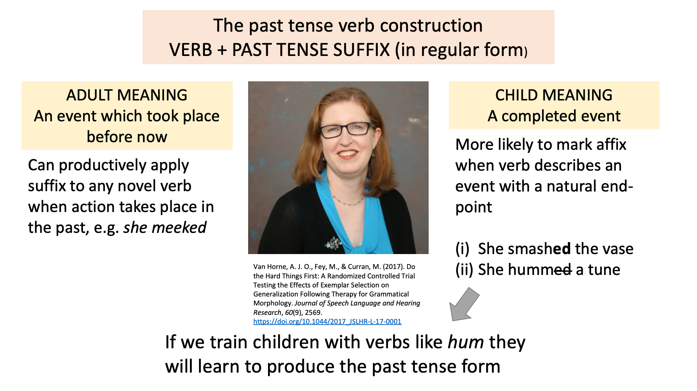

# 16 - Verbs in the passenger seat

## When verbs are in the passenger seat

1. She sneezed the napkin off the table

The issue with this sentence is that *sneeze* is typically an intransitive verb which does not take an object. Here it takes an object (*the napkin*), and a Prepositional Phrase expressing location (*off the table*). This is a very unusual use of *sneeze*. However, the meaning is transparent, that our sneeze propells the napkin off the table. The question is how are we able to comprehenend and produce such an utterance?

1. Traditional verb-centric story: we access the verb, then retrieve the argument structure from the lemma.

   PROBLEM: *sneeze* is unlikely to specify an argument structure with 3 entities. It is theoretically possible that we have a special meaning of sneeze in our lexicons, e.g. *sneeze* = make a sudden involuntary expulsion of air from the nose and mouth due to irritation of one's nostrils <u>such that the resulting air flow propels an object X from location Y</u>. But this is unlikely given the rarity of sentences with sneeze and three arguments.

2. The meaning of the sentence comes, in part, form the sentence frame or 'construction'.

   The construction NP$_1$ + V + NP$_2$ + PP means *NP$_1$ acts upon NP$_2$ such that NP$_2$ changes location*. The verb is then 'squished' into the construction, and the two meanings (verb + construction) are 'fused'

By assuming that constructions have meaning, we can overcome a lot of problems with traditional Verb Argument Structure accounts.

## Problems with traditional Verb Argument Structure accounts

### 1. Valency augmentation

We often use sentences with *more* arguments than the standard valency, e.g.

1. She sneezed the napkin off the table (example above)
2. The naughty students laughed the teacher out of the room
3. She juggled her way to the semi-finals of the juggling contest
4. Can you chop me some carrots?
5. Quote me happy! (Recent advert for insurance)

### 2. Weird thematic relations

There are plenty of verbs which take arguments with 'weird' roles, e.e.g

1. <u>She</u> is happy
2. <u>The table</u> needs a leg
3. <u>That coat</u> suits <u>you</u>
4. <u>The coat</u> fits <u>me</u>
5. <u>She</u> swapped <u>her Porsche</u> for <u>a Ferrari</u>
   Both a Porsche and a Ferrari can be described as PATIENTS, but this undermines the principle that there is differentiation between the arguments
6. <u>They</u> loaded <u>the truck</u> <u>with hay</u>
   Is *truck* a LOCATIVE or a PATIENT? If it is a PATIENT what kind of role does *hay* play? (assuming that all roles need to be differentiated?)

None of these roles can be easily described using standard labels. There is no list of thematic relations which can account for all arguments in English, or indeed any language. This is despite many **dozens** of attempts by linguists.

## How constructions solve these issues

### Goldberg's theory of Verb Argument Structure Constructions

Goldberg (1995) proposes that when we use verbs in setnences, we insert them into Verb Argument Structure Constructions (VAS Constructions). These are syntactic units with their own **independent meaning**. This can help explain both **valency augmentation** and **weird thematic relations**:

## Valency augmentation

Here are the two possible solutions:

1. The multiple sense account. We have different senses of verbs in our lexicons, some of which allow extra arguments. e.g. there is a lexical entry for *sneeze* which allows for three arguments
2. The construction based account. The extra argument is specified by the construction itself.

The multiple sense account is highly implausible. Given how rare it is to use *sneeze* with three arguments, it is very unlikely that we have such a representation in the lexicon.

### Weird thematic relations

If roles are (in part) given by the construction itself, we are not committed to a small and finite set of roles. For example we could posit the following constructions:

1. The copula construction:
   FORM: X is Y
   FUNCTION 1: X denotes the same referent as Y (e.g. One man's terrorist is another man's Freedom Fighter)
   FUNCTION 2: Y describes a property of X (e.g. Die hard is a great Xmas film)
   FUNCTION 3 (where X and Y are identical): X/Y has a property which is relevant to the current discussion (e.g. It wasn't a great film, but hey, George Clooney is George Clooney)
2. The "needing" construction:
   FORM: X + needing verb + Y
   FUNCTION: X needs Y (e.g. we're going to need a bigger boat, this task requires a bigger boat, this task necessitates a bigger boat)
3. The fit/suit construction:
   FORM: X + fit/suit + Y.
   FUNCTION: X (an item of clothing) looks good on Y (a person)

## How constructions combine with verbs

### Fusion

But surely the verbs must provide a role as well? Yes, verbs specify roles which are **highly specific to that verb**, while the VAS Construction specifies roles **which are more general**. When using a verb with a particular VAS Construction, we need to "fuse" the verb-specific role in the former, with the more general role in the latter.

### What about traditional roles, e.g. "AGENT" / "PATIENT"?

Many of the roles specified by VAS Constructions correspond to widely used traditional labels such as "AGENT" and "PATIENT", but many do not (e.g. the subject of the copula, or the subject of *need*).

Some roles appear to be more general than others because they

1. Occur in VAS Constructions with very general/abstract meanings and which allow lots of different verbs, e.g. AGENT + VERB + PATIENT
2. Describe slots with similar meanings in related constructions, e.g.
   THEME + VERB + EXP. = She scares me, They please George, The play entertained me
   EXP. + VERB + THEME = I fear her, George likes them, I enjoyed the play

### The implications of VAS constructions

The idea of VAS constructions contradicts with traditional "words and rules" approaches to grammar. According to these approaches, words are combined using rules, and then are semantically interpreted, e.g.

1. RULE: VP <- V + NP
2. RULE: Sentence <- NP + VP

INTERPRETATION: A situation involving two NPs whose roles are determined by the verb.

Late semantic interpretation can be explained by the fact that we always try to identify a meaning as long as the sentence is well formed, e.g.

1. Colourless green ideas sleep furiously

Words and rules approaches draw a categorical distinction between syntax (combinatorial rules) and the lexicon (repository of meaning)

However, according to Goldberg, syntactic constructions can also be meaningful. This breaks down the distinction between syntax and the lexicon. According to Goldberg, they are all part of the same system. Words involve mapping between form and meaning. Constructions also involve a mapping between form and meaning.

## Other types of construction (not VAS)

Multi-word constructions are everywhere, e.g.

1. You mean, I've got Arthritis Arthritis!!??
   FORM: The noun is repeated.
   MEANING: There is a scale of **authenticity** ranging from N to N + N (Arthritis to Arthritis Arthritis). N + N (Arthritis Arthritis) is at the high end of this scale.
2. There are burgers, and then there are burgers
   FORM: *There is/are* + NP *and then there is/are* + NP
   MEANING: There is a scale of **authenticity**, with the second NP at the top of the scale.
3. Now watch me go and drop this cake!
   FORM: Now watch + Clause (with nonfinite verb)
   MEANING: Sometimes called the "**tempting fate**" construction. It means I hope X DOESN'T happen, e.g. I hope I DON'T drop this cake.
4. She worked her way to the top of the class
   FORM: Subject + Verb + Possessive determiner (his, her, its) + "way" + PREPOSITIONAL PHRASE
   MEANING: X arrived at location Z by means of action Y. Progress is **difficult**, and the path is **circuitous**

These all display correspondences between form and meaning. The meanings are not predictable from general linguistic rules, i.e. they are non-compositional.

## Comparing the two models

According to the Words and Rules Approach

1. There is a categorical distinction between words (meaning) and rules (form)
2. Linguistic knowledge consists of (a) lexical knowledge, and (b) syntactic knowledge (ability to combine words)
3. Semantic interpretation of a sentence is seperate (and subsequent to) syntactic interpretation

According to Construction Grammar accounts

1. Words and syntactic constructions are all part of the **same system**, sometimes called the "Constructicon"
2. Linguistic knowledge = knowledge of constructions (words can be described as "minimal constructions")
3. Semantics and syntax are inseparable (as syntactic constructions are meaningful)

## Problems for construction grammar

Some syntactic phenomena do not appear to be linked to meaning, e.g. subject + verb agreement.

## Clinical implications

When teaching children grammatical constructions we need to highlight the **meaning** of those constructions. E.g. Riches (2013) highlights the meaning of the passive construction (the verb is highly affected), e.g.

1. The vase was smashed by the dog (Vase is highly affected)

This is reflected in children's early use of the passive. We very rarely have passives in which the subject is not highly affected, e.g.

2. The soldier was seen by the sailor. (The solider is not highly affected, e.g. they may not even be aware that they were seen)

According to Riches et al. (2013) we should teach the passives in contexts which highlight the core meaning of the construction, i.e. those with an affected subject.

However, an alternative approach was pioneered by Amanda Owen van Horne et al. (2017). She argued that we should deliberately tteach children constructions which were rendered difficult because there is a conflict between the meaning of the construction and the situation being described.

# Bibliography

Goldberg, A. E. (1995). *Constructions: a Construction Grammar approach to argument structure*. University of Chicago Press.

Riches, N. G. (2013). Treating the passive in children with specific language impairment: A usage-based approach. *Child Language Teaching and Therapy*, *29*(2), 155–169.

Van Horne, A. J. O., Fey, M., & Curran, M. (2017). Do the Hard Things First: A Randomized Controlled Trial Testing the Effects of Exemplar Selection on Generalization Following Therapy for Grammatical Morphology. Journal of Speech Language and Hearing Research, 60(9), 2569. https://doi.org/10.1044/2017_JSLHR-L-17-0001

 

